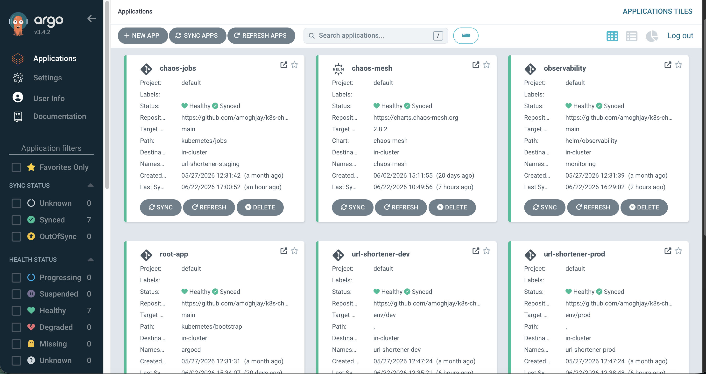
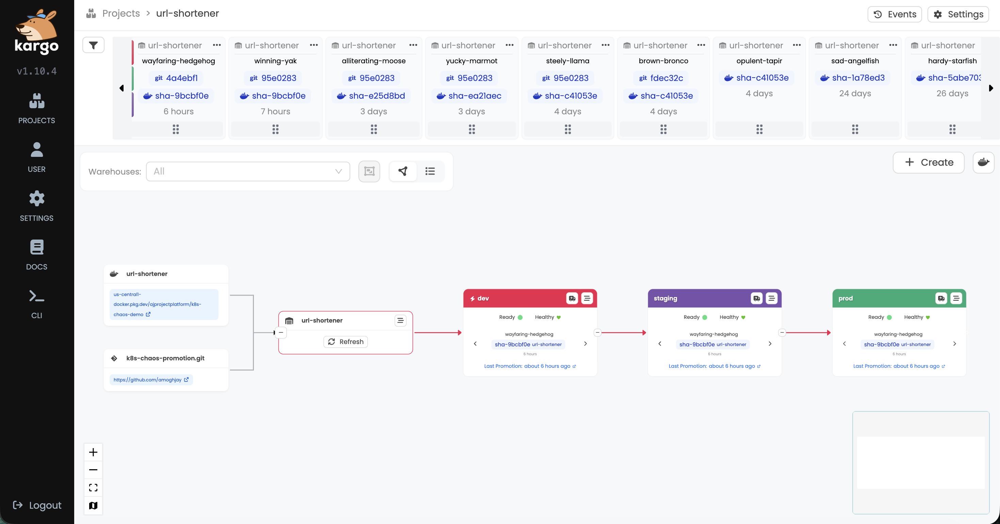
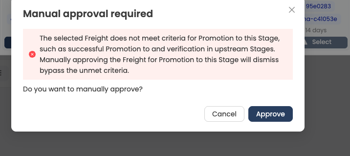
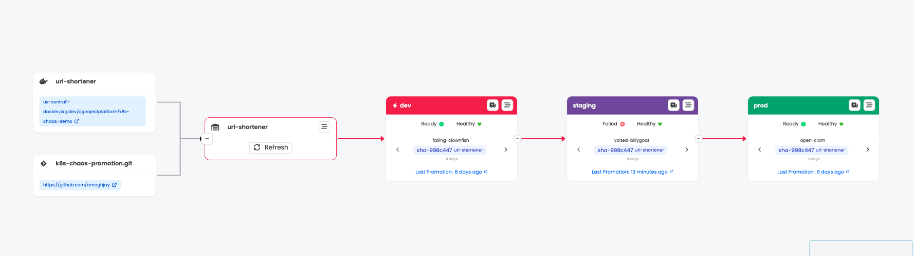

At work, I spent a lot of time inside GitOps pipelines, ArgoCD, Kargo, and policy
enforcement. Basically, the machinery that moves code from a git push to a running cluster. But I
always worked on *pieces* of it. A policy here, a NetworkPolicy there, a promotion step
someone else had already wired up. I never got to stand the whole thing up myself and own
every layer.

So I decided to build one from an empty GCP project. It took a few months. Along the way there were
internal migrations, plenty of things I broke and had to fix, and a fair amount I only understood
after it went wrong (with AI assistance along the way :) ). I wanted it to actually run the
patterns I'd read about and worked next to. Anyone can `kubectl apply` a Deployment; the
part I wanted to get right is everything around it: how config gets versioned, how secrets
reach a pod without living in git, how promotion between environments is gated, and what a
pod does when its database disappears. And then I wanted to push it one step past what most
pipelines do: **make it prove the app survives failure before it's allowed to ship.**

*Part 1 is the platform: GitOps, Helm, secrets, and the promotion
pipeline. Part 2 is how the load tests spend real on-chain money. Part 3 is the payoff:
a chaos gate that blocks a regression a normal health check waves straight through.*

---

## What I Set Out to Build

The app on top is a deliberately ordinary FastAPI URL shortener, except for two things.
Shortening a URL costs a real on-chain payment (x402 on a testnet, which is Part 2), and
when its database or cache goes down the app is built to degrade instead of fall over: a
request that can't reach Postgres gets a `503` with a `temporarily unavailable, retry shortly` message,
not a 500 and not a hang. I kept the app itself simple on purpose so the interesting
decisions would all sit in the platform around it. As someone who wants to work on the
infrastructure / platform / SRE side of things, that platform was the part I actually cared
about getting right.

So the question driving Part 1 is: **what does it actually take to build a GitOps
pipeline you'd trust to promote to prod on its own? Can you make it gate on more
than "the pod is running"?**

That last part is the thread worth following. Everything in this post is a precondition for
the resilience gate I build in Part 3, and nearly everything I got wrong turned out to be a
way that gate could have quietly lied to me. It could pass a build it never really tested, or
test a version that wasn't the one running. I'd used all these tools at work, but only in
pieces; standing the whole thing up myself, the sharp edges were never where the tutorials
said they'd be. Most of this post is those sharp edges.

## The Stack, Top to Bottom

The whole thing runs on one GKE cluster and is described entirely in git. The pieces:

- **GKE Standard**, 2× `e2-standard-2`, one node pool, provisioned with Terraform.
  I chose Standard instead of Autopilot. I hit that wall on purpose in Part 3, but the short
  version is Autopilot won't run the privileged DaemonSet the chaos tooling needs.
- **ArgoCD** in an app-of-apps layout, where one root Application installs everything else.
- **Kargo** for promotion: dev → staging → prod, with real gates between them.
- **External Secrets Operator** pulling from GCP Secret Manager over Workload Identity.
- **kube-prometheus-stack + Loki + Grafana** for metrics and logs.
- A **Helm chart** for the app, with a values overlay per environment.


*Read it left to right: CI builds and signs the image, Kargo turns it into Freight, staging has to survive the chaos gate, and ArgoCD syncs each rendered environment branch into GKE.*

Here is how those pieces fit together, including the places where the obvious approach
turned out to be quietly wrong.

## GitOps: One Root App, and a Boundary I Learned to Draw

ArgoCD runs as an **app-of-apps**: a single root Application watches `kubernetes/bootstrap/`
and installs the platform components in **sync-wave order**. External Secrets goes first
(wave 1), then the observability stack (wave 2), then the chaos tooling (wave 3). Ordering
matters because later waves depend on earlier ones: an app that references a secret store
that doesn't exist yet just fails. Rebuilding the entire cluster is one `kubectl apply` of
the root app plus loading secrets.


*Every component on the cluster is an ArgoCD Application owned by one root app. Rebuilds are declarative and repeatable.*

There's one boundary here I got wrong first and want to call out. The three application
environments (`dev`/`staging`/`prod`) are created by an **ApplicationSet**, but they are
deliberately *not* managed under the root app-of-apps. Kargo updates those Applications
during promotion. If the root app also reconciled them, two controllers would fight
over the same object forever. The rule I settled on is that the root app owns the platform
components and Kargo owns the app environments, and nothing is reconciled by both.

## The Promotion Pipeline, and Why "GitOps" Wasn't Actually Gating Anything

Kargo models promotion as **freight**, an immutable set of artifacts (here, a container
image tag) moving through **stages**. A Warehouse polls the registry for new `sha-` tags,
turns each into freight, and flows it dev → staging → prod. Dev auto-promotes; staging and
prod are gated.


*Each column is a freight (one image build). It only moves right when the stage's verification passes.*

Here's the part I got wrong, and it's worth the detour because it's a mistake that looks
fine right up until it bites.

I pushed a small change to the Helm chart, just a probe path tweak, and went to
watch it move through dev and into staging like everything else. Except it was already in
prod. Within a minute. No promotion, no gate, nothing had stopped it. I sat there for a
second genuinely confused, because I'd spent weeks building a promotion pipeline whose entire
job was to *not* let that happen. Then it clicked: only the image **tag** was flowing through
Kargo. All three environments were reading the Helm chart live from `main`, so any change to
the chart or values skipped the pipeline completely. The gate had a hole in it exactly the
size of "everything that isn't an image tag."

The fix is a pattern that's worth knowing by name: **rendered branches**. Instead of each
environment rendering the Helm chart itself from `main`, the *promotion step* runs
`helm template` and commits the resulting plain YAML to a per-environment branch:
`env/dev`, `env/staging`, `env/prod`. ArgoCD watches the rendered branch, not the chart:

```yaml
# kubernetes/apps/applicationset.yaml
source:
  repoURL: https://github.com/amoghjay/k8s-chaos-promotion.git
  targetRevision: env/{{env}}   # the rendered branch, NOT main
  path: .
  directory:
    recurse: true   # rendered output nests under templates/ + charts/;
                    # without this ArgoCD finds 0 manifests at the root and prunes to empty
```

That `recurse: true` line cost me a scare. The `helm template` output nests manifests under
`url-shortener/templates/` and `charts/`, and ArgoCD doesn't recurse into subdirectories by
default. Without it, the app finds nothing at the root and prunes itself down to empty. I
caught it by sanity-checking what had actually landed in `env/dev` before flipping staging and
prod over, which I'd recommend to anyone standing this up: look at the rendered branch with
your own eyes before you trust it.


*This is what ArgoCD actually watches: plain YAML on `env/staging`, committed by Kargo itself, with no Helm in the loop. (That `checksum/config` annotation on line 31 is the next section's whole story.)*

Now a chart change is just another change that has to earn its way forward. It lands in
`env/dev` only when dev promotes, reaches `env/staging` only through a promotion, and gets
tested there like everything else. Config changes cause outages just as often as code
changes, so a pipeline that only versions image tags leaves a whole category of breakage
ungated. That was the hole in mine, and it's the first way the resilience gate could have
lied to me: a gate can only test changes that actually pass through it, and my config changes
weren't passing through it at all.

> **The takeaway:** a GitOps gate only means something if every deployable change, including
> images and configuration, is forced through the same promotion path.

Prod keeps a manual gate on top of everything. If you try to promote freight that didn't
pass verification upstream, Kargo makes you say so explicitly:


*You can override the gate, but only on purpose, and it's recorded.*

## The Helm Chart, Done Properly

The chart has one `values.yaml` and a thin overlay per environment
(`values-dev.yaml`, `values-staging.yaml`, `values-prod.yaml`), plus a
`values-staging-fragile.yaml` I use to deliberately under-resource staging for chaos runs.
Same chart everywhere; only the knobs differ.

Two details in the chart do more work than their size suggests, and I only added the first
one because it bit me.

**A config-only change syncs cleanly and does nothing.**

I had a one-line config change to ship: set the app's worker count to 1. I committed it,
watched it promote through the pipeline, and watched ArgoCD sync the new ConfigMap. Green
across the board. Then I checked a running pod with `printenv` and it still had the old
value. The pods had never restarted. It turns out a ConfigMap update on its own doesn't roll
the Deployment. The pods keep reading the old values until something else happens to restart
them, and nothing was going to. So the change "shipped" and did nothing at all. There was no
error or warning, just the old value quietly still in place.


The fix is five lines: put a checksum of the rendered ConfigMap into the pod template's
annotations.

```yaml
# helm/url-shortener/templates/deployment.yaml
annotations:
  # Roll pods when the rendered ConfigMap changes. Otherwise a config-only
  # promotion updates the ConfigMap without restarting anything.
  checksum/config: {{ include (print $.Template.BasePath "/configmap.yaml") . | sha256sum }}
```

Now a config change changes the checksum, which changes the pod template, which rolls the
Deployment. This one turned out to be load-bearing for the chaos gate in Part 3: without it,
a config-only promotion would sync but never restart the pods, so the gate would run against
pods still on the old config and happily pass a change that isn't actually live.

The chart also ships a **PodDisruptionBudget** so a node drain can't take both replicas at
once, `preferred` (not `required`) **pod anti-affinity** so the two replicas spread across
nodes without wedging the scheduler on a two-node cluster, and real resource requests and
limits. None of this is fancy, but it's the kind of thing that's easy to skip in a demo and
annoying to retrofit once you're actually relying on the chart.

## Probes as a Resilience Primitive

This is the one I wish someone had drilled into me earlier, because it's easy to get wrong,
I got it wrong myself (Part 3), and the chart comments say exactly why:

```yaml
# helm/url-shortener/templates/deployment.yaml
livenessProbe:
  # /livez is process-only and never touches Postgres/Redis. A dependency
  # outage must fail readiness, not liveness (a restart can't fix a
  # downstream DB and cascades instead).
  httpGet: { path: /livez, port: http }
readinessProbe:
  # /ready requires Postgres + Redis on first startup, then only Postgres.
  httpGet: { path: /ready, port: http }
```

Liveness and readiness answer different questions. Liveness is "is this process wedged and
does it need a restart?" Readiness is "can this pod serve traffic right now?" If you wire
liveness to your database, a database blip makes Kubernetes *restart your pods*. The restart
can't fix the database, so a short dependency outage becomes a longer one as every pod cycles
for no reason. So `/livez` deliberately checks nothing but the process itself, and anything
that touches Postgres or Redis is checked in `/ready`.

I'm flagging this in Part 1 because it's the seed of Part 3's best war story: the first time
I ran a database-outage experiment, I had this wrong, and I watched a 60-second outage
become an 85-second one as both pods dutifully restarted. More on that later.

## Secrets: In the Cluster, Never in Git

Nothing secret lives in the repo. The **External Secrets Operator** (ESO) pulls secrets from
GCP Secret Manager at runtime, and the part I care about most is how it authenticates: it uses
**Workload Identity**, so there's no downloaded key anywhere. No service-account JSON file is
mounted in a pod or committed to git. Instead, the operator's Kubernetes service account *is* a
GCP identity, and GKE hands it short-lived tokens automatically. Downloaded keys are a recurring
source of breaches. They leak into logs, get committed by accident, and outlive their rotation
windows. With Workload Identity there's no key to leak in the first place.

In Secret Manager I store only the raw components, such as the database password and service
wallet address. The app's `ExternalSecret` assembles the full `DATABASE_URL` from them with a
template. So the connection string's shape lives in the chart and Secret Manager holds nothing
but the actual secret values. Rotating a password is a one-line change there, and ESO updates
the Kubernetes Secret within its refresh interval. That is not the same as the running app
seeing the new value: `DATABASE_URL` is injected as an environment variable, so the pods still
need a controlled restart before the process picks it up. ESO solves secret distribution, not
process reload semantics. The same keyless model runs in CI, where GitHub Actions pushes images
over OIDC and no registry credentials are stored anywhere.

## Observability and Cost

I treated metrics and logs as part of the platform from the start: kube-prometheus-stack
scrapes the app (it exports ~40 custom metrics), Loki collects logs, and the dashboards live
in git. In Parts 2 and 3 those dashboards are what the promotion gate actually reads to
decide whether a release ships, so I'll let them earn their screenshots there.

And the part everyone asks about: with the way I use it, this GKE **Standard** setup has cost
about **$14–17/month**. The trick is scaling the node pool to zero between sessions
(`gcloud container clusters resize --num-nodes=0`). Google's current
[GKE free tier](https://cloud.google.com/kubernetes-engine/pricing) provides a monthly credit
that offsets the management fee for one zonal Standard or Autopilot cluster; it does *not*
cover the nodes, networking, or storage. With the node pool at zero, the cluster state and
PVCs remain, and the whole platform comes back in about two minutes. I don't run
`terraform destroy`; I just turn the compute off.

## What I Learned Along the Way

### A Few Secrets Have to Be Applied by Hand

This is the GitOps bootstrap chicken-and-egg.

My plan was that every single thing on the cluster would come from git. Run one `kubectl apply`
for the root app, then walk away. That mostly held, but a few things can't work that way, and
the reason is circular. ArgoCD reads the repo that defines everything else, but to clone a
private repo it needs a git credential, and that credential obviously can't live in the repo
it hasn't cloned yet. Same shape for the Grafana admin secret: it goes into the `monitoring`
namespace, but that namespace doesn't exist until the root app has already synced. So a
handful of secrets have to be applied out-of-band, once, right after bootstrap, before the
GitOps loop can take over. Everything downstream of those is declarative; those specific ones
are the seam where the automation has to start by hand. Knowing *which* things are inherently
un-GitOps-able (the bootstrap credential, anything a controller needs before its namespace
exists) turned out to be a real part of designing the platform, and it's not something the
tutorials mention.


### Terraform Got the Dependency Order Wrong

On the very first `terraform apply` from an empty project, the External Secrets Workload Identity
binding failed with `Identity Pool does not exist`. The binding references the cluster's
Workload Identity pool, but Terraform's dependency graph couldn't see that link on its own, so
it attempted the IAM binding before GKE had finished creating the cluster (and its pool). The
fix was a one-line explicit `depends_on` the cluster. It's an ordering bug you only hit on a
from-scratch apply; run against an already-built cluster and it never shows up at all, which is
what makes it so easy to leave lurking in your Terraform.

## Where This Goes Next

By the end I had a platform I trusted: config versioned through promotion, secrets that never
touch git, a chart that rolls its pods on a config change, and probes that don't turn a
dependency blip into a self-inflicted outage. Those last two are exactly why I'll be able to
believe the gate later when it says a build survived a database outage. That's the real
takeaway: "healthy" and "safe to ship" are different claims, and closing the gap starts here,
with a platform disciplined enough that a gate built on it means something. Concretely, it's
what lets the pipeline do this: block a build from prod that didn't survive a dependency
outage, even though every health check said it was fine:


*Staging is red because the freight failed the resilience gate, even though the health check passed. The broken build never reaches prod. How that gate works is Part 3.*

Every gate so far still only answers one question: *is it up?* The gate I actually wanted
answers *does it survive failure?* To answer that honestly, the load test driving it
can't send fake traffic. It has to exercise the app's real transaction, which here is an
on-chain payment. Making that work is Part 2.

The most reusable piece here, if you're already running ArgoCD and shipping Helm charts, is
the rendered-branches pattern. It's the change that made my config changes actually stop at
the gates instead of sailing straight to prod. The full setup is in the repo if you want to
pull it apart.

---

*The full project is at [github.com/amoghjay/k8s-chaos-promotion](https://github.com/amoghjay/k8s-chaos-promotion).*
