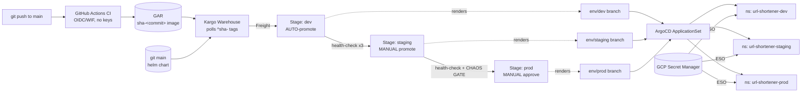
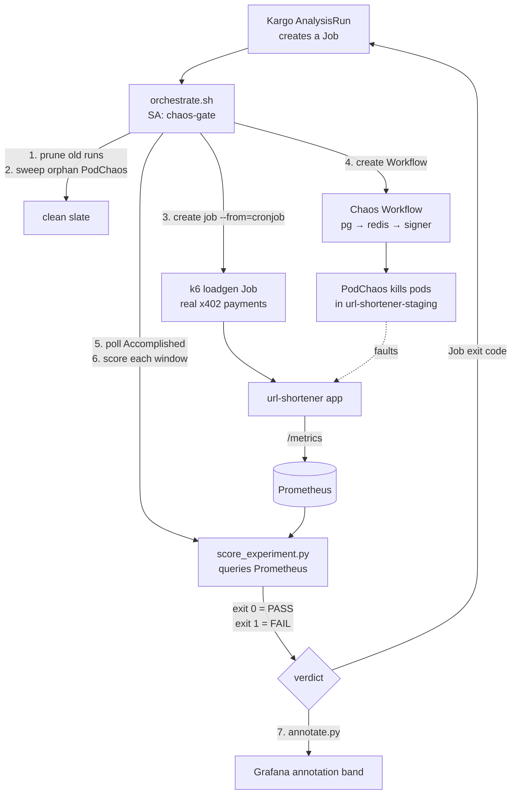

# Kubernetes Architecture & Live-Cluster Practice Guide

> **What this is.** A single reference that (1) documents the Kubernetes architecture actually deployed in this repo, and (2) maps every piece back to a core Kubernetes fundamental with concrete `kubectl` drills you can run on the live cluster. Read the top half to understand the system; use the bottom half (§7) to *practice and demonstrate* fundamentals on the real cluster.
>
> All facts here were checked against the manifests — citations are repo-relative links you can click.

---

## 1. How to Use This Doc

- **§2–§5** — the architecture, layer by layer. Each layer ends with **"Fundamental it demonstrates"** so you always know *which K8s concept* you're looking at.
- **§6** — a reverse index: pick a fundamental (Services, RBAC, probes…) and jump to where it lives + the drill that exercises it.
- **§7** — the hands-on core. Drills grouped by fundamental. Each is **goal → commands → what to observe → "explain it back."**
- **§8** — the "why" talking points, for explaining design decisions out loud.

**Step zero of every practice session** — the cluster scales to zero between sessions to save cost. Bring it back first:

```bash
# 1. Scale nodes back up
gcloud container clusters resize chaos-promotion \
  --num-nodes=2 --node-pool=default-pool \
  --zone=us-central1-a --project=ajprojectplatform

# 2. Point kubectl at it
gcloud container clusters get-credentials chaos-promotion \
  --zone=us-central1-a --project=ajprojectplatform

# 3. Wait for nodes + system pods Ready (≈2–4 min), then verify
kubectl get nodes
kubectl get pods -A | grep -v Running | grep -v Completed   # should drain to empty
```

When done for the day, scale back to zero (never `terraform destroy` — etcd + PVCs persist across scale events):

```bash
gcloud container clusters resize chaos-promotion \
  --num-nodes=0 --node-pool=default-pool \
  --zone=us-central1-a --project=ajprojectplatform
```

---

## 2. Cluster Topology — the Foundation

| Property | Value |
|----------|-------|
| Cluster | GKE `chaos-promotion`, zone `us-central1-a` |
| Nodes | 2× `e2-medium` on `default-pool` |
| Mode | **GKE Standard** (not Autopilot) |
| Project | `ajprojectplatform` |
| Registry | `us-central1-docker.pkg.dev/ajprojectplatform/k8s-chaos-demo` |

**Why Standard, not Autopilot?** Chaos Mesh's `chaos-daemon` runs as a **privileged DaemonSet** that needs the node's container runtime socket — Autopilot blocks privileged pods. The cluster is **memory-bound, not CPU-bound** on 2× e2-medium, which is why `chaos-pool` (a separate Spot pool that was going to host node-drain experiments) sits **parked at 0** — chaos runs on `default-pool` alongside its targets at no extra cost.

### Namespace map

Namespaces are the primary unit of **isolation** and **blast-radius control** in this design.

| Namespace | What lives there | Fundamental it teaches |
|-----------|------------------|------------------------|
| `argocd` | ArgoCD + the `root-app` and 3 env `Application`s | GitOps controller, namespaced control plane |
| `kargo` | Kargo promotion engine | Operator pattern |
| `cert-manager` | cert-manager (hard Kargo dependency — TLS for admission webhooks) | Admission webhooks need TLS |
| `argo-rollouts` | Argo Rollouts CRDs (back the Kargo `AnalysisTemplate`s) | CRDs as shared primitives |
| `external-secrets` | External Secrets Operator (ESO) | Secret sync controller |
| `monitoring` | kube-prometheus-stack + Loki + Promtail + Grafana | Observability plane |
| `chaos-mesh` | Chaos Mesh controller + chaos-daemon DaemonSet | Operator + node agent |
| `url-shortener` | Kargo `Project`/`Warehouse`/`Stage`s + the chaos-gate SA | Control vs. workload separation |
| `url-shortener-dev` | App — dev env (auto-promoted) | Per-env isolation |
| `url-shortener-staging` | App — staging env **+ signer + loadgen + chaos targets** | The one chaos-enabled ns |
| `url-shortener-prod` | App — prod env (manual gate) | Protected by namespace opt-out |

**The safety label.** Only `url-shortener-staging` carries the annotation `chaos-mesh.org/inject: enabled` ([`kubernetes/bootstrap/chaos-mesh-ns-annotation.yaml`](../kubernetes/bootstrap/chaos-mesh-ns-annotation.yaml)). With `enableFilterNamespace: true` on the controller, *no other namespace can be targeted by fault injection* — prod, kube-system, and the control planes are structurally protected.

---

## 3. Big-Picture Diagrams

### 3.1 End-to-end promotion flow



**The key idea:** Kargo never runs Helm in-cluster. Each Stage *renders* the Helm chart to plain YAML and commits it to an `env/<env>` branch; ArgoCD just applies that rendered branch. A chart/config change therefore reaches an env **only by flowing through the same dev → staging(chaos) → prod gates as an image change** — there's no ungated config back-door.

### 3.2 Inside the chaos gate (the staging gate)



---

## 4. Architecture, Layer by Layer

> Each subsection: *what it is → the K8s objects → key fields → files → **Fundamental it demonstrates.***

### 4.1 GitOps control plane — ArgoCD

**App-of-Apps.** A single root `Application` ([`kubernetes/argocd/root-app.yaml`](../kubernetes/argocd/root-app.yaml)) watches `kubernetes/bootstrap/` on `main` with `automated: {prune, selfHeal}`. Everything in that directory is itself a child resource, applied in **sync-wave** order:

| Wave | Child `Application` | Chart/path | Destination ns | Notes |
|------|--------------------|-----------|----------------|-------|
| 2 | `observability` | `helm/observability` | `monitoring` | `ServerSideApply=true` (CRDs too big for client-side apply) |
| 3 | `chaos-mesh` | `charts.chaos-mesh.org` v2.8.2 | `chaos-mesh` | `ServerSideApply=true`; namespace-filtered |
| 5 | `chaos-jobs` | `kubernetes/jobs` | `url-shortener-staging` | signer + loadgen |
| 6 | `chaos-gate` | `kubernetes/chaos-experiments` | `url-shortener` | gate scripts ConfigMap + RBAC |

Waves enforce ordering: observability must exist before chaos (the gate queries Prometheus); chaos-mesh before the jobs it will target; the gate last, since it consumes all of the above.

**ApplicationSet** ([`kubernetes/apps/applicationset.yaml`](../kubernetes/apps/applicationset.yaml)) — a **List generator** with 3 hardcoded elements (dev/staging/prod) templates one `Application` per env. The critical fields:
- `targetRevision: env/{{env}}` — each app tracks its own **rendered branch**, *not* `main`. Static; Kargo never mutates it.
- `path: .` + `directory.recurse: true` — applies pre-rendered YAML; **no `helm:` block**, ArgoCD never templates.
- `annotations: kargo.akuity.io/authorized-stage: "url-shortener:{{env}}"` — mandatory for Kargo's `argocd-update` step to drive the app.

> **Note:** `kubernetes/apps/` and `kubernetes/kargo/` are deliberately **not** under `root-app` — Kargo and ArgoCD must not both own the same Applications (sync loops). They're applied by the bootstrap automation.

**Fundamentals:** declarative desired-state, controllers & continuous reconciliation, CRDs (`Application`/`ApplicationSet`), ordering with sync-waves, drift correction (`selfHeal`).

### 4.2 Kargo promotion pipeline

| Object | File | Role |
|--------|------|------|
| `Project` | [`project.yaml`](../kubernetes/kargo/project.yaml) | namespace + tenancy boundary |
| `ProjectConfig` | [`projectconfig.yaml`](../kubernetes/kargo/projectconfig.yaml) | auto-promote `dev` only; staging+prod manual |
| `Warehouse` | [`warehouse.yaml`](../kubernetes/kargo/warehouse.yaml) | watches GAR (`^sha-` tags, `NewestBuild`) **and** git `main` (`helm/url-shortener/**`) → produces *Freight* |
| `Stage` × 3 | [`stage-dev.yaml`](../kubernetes/kargo/stage-dev.yaml), [`stage-staging.yaml`](../kubernetes/kargo/stage-staging.yaml), [`stage-prod.yaml`](../kubernetes/kargo/stage-prod.yaml) | promotion steps + verification |
| `AnalysisTemplate` × 2 | [`analysistemplate.yaml`](../kubernetes/kargo/analysistemplate.yaml) | `health-check` (web probe ×3) + `chaos-gate` (Job) |

**Each Stage's promotion steps** (inlined, identical shape across envs — see [`stage-staging.yaml`](../kubernetes/kargo/stage-staging.yaml#L24-L65)):
`git-clone` (source commit → `./src`, env branch → `./out`) → `yaml-update` (inject `image.tag` into `values-<env>.yaml`) → `git-clear ./out` → `helm-template` (render chart → `./out`) → `git-commit` → `git-push` to `env/<env>` → `argocd-update`.

**Verification** runs *after* promotion. Dev and prod use only `health-check`; **staging adds `chaos-gate`** ([`stage-staging.yaml:69-75`](../kubernetes/kargo/stage-staging.yaml#L69-L75)) — only freight that survives fault injection advances to prod. Prod itself has no auto-verification; the gate there is the manual UI approval.

**Fundamentals:** progressive delivery / promotion gates, Jobs as a pass/fail signal, separation of "what to deploy" (Freight) from "where" (Stage).

### 4.3 The application workload — Helm chart `helm/url-shortener/`

This is where the densest fundamentals live. Chart at [`helm/url-shortener/`](../helm/url-shortener/); subcharts: Bitnami **PostgreSQL** + **Redis**.

**Deployment** ([`templates/deployment.yaml`](../helm/url-shortener/templates/deployment.yaml)):
- `replicas: {{ .Values.replicaCount }}` — 1 in dev, **2 in staging/prod**.
- Pod label `app: url-shortener` (line 18) — an **explicit label so Chaos Mesh selectors can target it** (separate from the `app.kubernetes.io/*` selector labels).
- `checksum/config` annotation (line 25) — a sha256 of the rendered ConfigMap. **A config-only change produces a byte-identical pod spec, so pods wouldn't restart; this annotation forces a rollout** so the chaos gate never validates stale config.
- **Liveness vs. readiness — the load-bearing distinction (lines 60-81):**
  - `livenessProbe → /livez` — process-only, **never touches Postgres/Redis**. Liveness answers *"should k8s restart this process?"* A restart can't fix a downstream DB outage, so dependencies must **not** affect liveness.
  - `readinessProbe → /ready` — requires Postgres (+ Redis on first start). A dependency outage **pulls the pod from Service endpoints** but does not restart it.
  - This was learned the hard way: an early `/health` liveness probe turned a 60s Postgres blip into a **cascading restart of every replica**. (See §8.)
- `podAntiAffinity` (lines 34-46) — `preferred` (not `required`) on `topologyKey: kubernetes.io/hostname`, so pods spread across the 2 nodes but still schedule if a node is full.
- `automountServiceAccountToken: false` — the app doesn't talk to the API server, so no token is mounted (least privilege).

**Service** ([`templates/service.yaml`](../helm/url-shortener/templates/service.yaml)) — `ClusterIP`, port **80 → targetPort 8000**. Reachable in-cluster at `url-shortener-<env>.url-shortener-<env>.svc.cluster.local:80`.

**PodDisruptionBudget** ([`templates/pdb.yaml`](../helm/url-shortener/templates/pdb.yaml)) — `minAvailable: 1`, enabled in staging/prod. Protects against **voluntary** disruptions (node drain, rolling update) — not pod-failure chaos.

**Config & secrets:**
- `ConfigMap` ([`templates/configmap.yaml`](../helm/url-shortener/templates/configmap.yaml)) — `BASE_URL`, `CODE_LENGTH`, `REDIS_TTL`, `WORKERS`, Redis URL, Radius/x402 settings. Mounted via `envFrom`.
- `Secret` vs `ExternalSecret` — toggled by `externalSecrets.enabled`. In-cluster envs use the `ExternalSecret` ([`templates/externalsecret.yaml`](../helm/url-shortener/templates/externalsecret.yaml)) pulling DB password + wallet address from GCP; local dev falls back to a plain `Secret`.

**Environment overlays** (the same chart, four value files):

| | dev | staging | prod | staging-**fragile** |
|--|-----|---------|------|---------------------|
| replicas | 1 | 2 | 2 | **1** |
| podAntiAffinity | off | on | on | **off** |
| PDB | off | on (min 1) | on (min 1) | **off** |
| requests | 50m / 64Mi | 100m / 128Mi | 200m / 256Mi | (inherits staging) |
| limits | 200m / 256Mi | 500m / 512Mi | 1000m / 1Gi | (inherits staging) |
| Radius | testnet | testnet | **mainnet** facilitator | testnet, `timeout: 2s` |
| PG persistence | — | default | 5Gi | **disabled** |

[`values-staging-fragile.yaml`](../helm/url-shortener/values-staging-fragile.yaml) is purpose-built to **fail the gate**: single replica + no PDB + no persistence + a 2-second facilitator timeout. It's the negative-test overlay that proves the gate catches a resilience regression a plain health-check would miss.

**`WORKERS: "1"` everywhere** — `prometheus_client` counters are per-process, so `uvicorn --workers >1` gives each worker its own counter and Prometheus scrapes a random one, **fabricating phantom traffic** under `rate()`. The app is async with 2 replicas, so one worker per pod is correct anyway.

**Fundamentals:** Deployments/ReplicaSets, Services + cluster DNS + Endpoints, liveness vs. readiness probes, scheduling/affinity, PodDisruptionBudgets, ConfigMaps vs. Secrets, resource requests/limits, the config-checksum rollout trick.

### 4.4 Secrets — External Secrets Operator (ESO)

A `ClusterSecretStore` named `gcp-secret-manager` ([`secrets/cluster-secret-store.yaml`](../kubernetes/bootstrap/secrets/cluster-secret-store.yaml)) authenticates to **GCP Secret Manager via Workload Identity** (the ESO pod's KSA is bound to a GCP SA — no static key in the cluster). `ExternalSecret` resources across namespaces then sync individual secrets:

| ExternalSecret | ns | Backs |
|----------------|----|----|
| argocd repo cred | `argocd` | git auth for ArgoCD |
| grafana admin | `monitoring` | Grafana login |
| grafana annotation token | `url-shortener` | chaos-gate → Grafana |
| db password + wallet | `url-shortener-{dev,staging,prod}` | app `Secret` |
| signer RPC + wallet | `url-shortener-staging` | radius-signer |
| loadgen wallet keys ×3 | `url-shortener-staging` | k6 payment signing |

> **Ordering trap (the "manual gap"):** an `ExternalSecret` targeting `monitoring` can't sync until the `monitoring` namespace exists — so the Grafana ExternalSecret must be applied *after* `root-app` creates the namespace. The bootstrap automation encodes this.

**Fundamentals:** secret management, Workload Identity (pod identity without keys), controller-driven sync, namespace-scoped resources.

### 4.5 Observability

Chart at [`helm/observability/`](../helm/observability/) → `monitoring` ns. Components: **Prometheus** (kube-prometheus-stack, 7d retention, PVC-backed), **Grafana**, **Loki** (SingleBinary, filesystem, 48h), **Promtail** (DaemonSet tailing `/var/log/pods` → Loki), **node-exporter**.

- **ServiceMonitors** ([`helm/observability/templates/servicemonitor.yaml`](../helm/observability/templates/servicemonitor.yaml)) — one per app namespace, all labeled `release: observability` so Prometheus's selector picks them up. They select pods by `app.kubernetes.io/name: url-shortener` and scrape `/metrics` every 15s. The signer ships its own ServiceMonitor inline ([`kubernetes/jobs/radius-signer.yaml`](../kubernetes/jobs/radius-signer.yaml)).
- **Dashboard** ([`helm/observability/templates/dashboard-cm.yaml`](../helm/observability/templates/dashboard-cm.yaml)) — a ConfigMap labeled `grafana_dashboard: "1"`; Grafana's sidecar auto-discovers it. Carries 4 annotation queries: postgres/redis `dependency_up == 0`, signer `up == 0`, and chaos-gate **PASS/FAIL** tag bands (posted by `annotate.py`).

**Fundamentals:** the pull/scrape model, label-selector wiring (the `release:` label is the contract), DaemonSets (Promtail), sidecar discovery, PVC-backed retention surviving scale-to-zero.

### 4.6 Chaos engineering — Chaos Mesh

Bootstrapped at wave 3 ([`kubernetes/bootstrap/chaos-mesh.yaml`](../kubernetes/bootstrap/chaos-mesh.yaml)) with GKE-hardened values:
- `chaosDaemon.runtime: containerd` + `socketPath: /run/containerd/containerd.sock` — GKE uses containerd, not docker (the chart default would CrashLoop).
- `controllerManager.replicaCount: 1`, `leaderElection.enabled: false` — a 2-node cluster needs no HA.
- **`enableFilterNamespace: true`** — fault injection is **opt-in per namespace** (the blast-radius lock).
- `ServerSideApply=true` — the `Workflow`/`Schedule`/`WorkflowNode` CRDs are 643KB–1.3MB, over the 262144-byte client-side apply annotation limit.

**Experiments** ([`kubernetes/chaos-experiments/`](../kubernetes/chaos-experiments/)) — three standalone `PodChaos` CRs (`01-postgres`, `03-redis`, `04-signer`), each `action: pod-failure`, `mode: one`, plus a serial **`Workflow`** ([`workflow.yaml`](../kubernetes/chaos-experiments/workflow.yaml)) that runs them under load:

```
warmup (90s, Suspend) → postgres (120s) → redis (90s) → signer (90s) → settle (60s)
```

Selectors target by label within `url-shortener-staging` only — e.g. postgres = `app.kubernetes.io/{name=postgresql, instance=url-shortener-staging, component=primary}`; signer = the raw `app: radius-signer` pod label.

> **Blast-radius lock blocks at *selection*, not *admission*.** A PodChaos pointed at a non-annotated namespace is still *created* — the controller just selects **0 targets** (`Selected=False`) and harms nothing. Don't expect the API to reject it; expect a created object that does nothing.

**Fundamentals:** CRDs + operators, label selectors as a targeting mechanism, the workflow/orchestration CRD pattern, opt-in safety controls.

### 4.7 The chaos gate — the centerpiece

The gate is a `Job` (created by Kargo's `chaos-gate` AnalysisTemplate, [`analysistemplate.yaml:27-73`](../kubernetes/kargo/analysistemplate.yaml#L27-L73)) running [`orchestrate.sh`](../kubernetes/chaos-experiments/orchestrate.sh):

1. **Prune** prior workflows by label `app=chaos-gate`.
2. **Sweep orphaned PodChaos** (a fault stuck `Terminating` on a finalizer once wedged the signer ~44m and would poison the next run).
3. **Fire loadgen** — `kubectl create job --from=cronjob/loadgen`.
4. **Create the Workflow**, capture its generated name.
5. **Poll** for `Accomplished` (up to ~15m).
6. **Read each WorkflowNode's `.spec.startTime`** to anchor scoring windows; **score** each experiment with [`score_experiment.py`](../kubernetes/chaos-experiments/score_experiment.py) (queries Prometheus over HTTP). Exit 0 = all SLOs held, exit 1 = any collapsed.
7. **Annotate** Grafana with the verdict ([`annotate.py`](../kubernetes/chaos-experiments/annotate.py)).

**The scorer's checks** (per experiment) include a **vacuous-pass / traffic guard** — `http_requests_total{handler!="/livez"} > 50` — so a run where *no load actually flowed* fails instead of trivially passing. (This caught a real FALSE-PASS: an orphaned PodChaos held a pod `Terminating`, zero traffic reached the app, and the gate went green on nothing.) It also asserts 0 app restarts (the liveness-cascade detector), `dependency_up` flipping down-then-up, no 5xx/409 replay, etc.

**Packaging:** [`docker/gate-runner/Dockerfile`](../docker/gate-runner/Dockerfile) — `python:3.12-slim` + pinned `kubectl`; scripts are *not* baked in, they mount from the `chaos-gate-scripts` ConfigMap at runtime. CI builds it to GAR as `gate-runner:v1` (`imagePullPolicy: Always` since `:v1` is a mutable tag).

**Cross-namespace RBAC** ([`chaos-gate-rbac.yaml`](../kubernetes/chaos-experiments/chaos-gate-rbac.yaml)) — the cleanest RBAC lesson in the repo:
- `ServiceAccount` **chaos-gate** in `url-shortener` (where the Job runs).
- `Role` **chaos-gate** in `url-shortener-staging` (where it acts).
- `RoleBinding` in `url-shortener-staging` whose **subject is the SA in the *other* namespace** — that's how a SA in ns A gets verbs in ns B.
- A subtle rule: both **plural `workflows`** *and* **singular `workflow`** are granted. `kubectl auth can-i create workflows` normalizes via discovery, but Chaos Mesh's `vauth` webhook does a *raw* SubjectAccessReview with `resource = "workflow"` (lowercased Kind) and matches the string **literally** — without the singular rule the webhook denies even though `kubectl auth can-i` says yes.

**Fundamentals:** RBAC (SA / Role / RoleBinding), **cross-namespace authorization**, Jobs as gates, admission webhooks as a second authz layer, finalizers & stuck-resource cleanup.

### 4.8 Signer + loadgen workloads

Both live in `url-shortener-staging` ([`kubernetes/jobs/`](../kubernetes/jobs/), wave 5):

- **`radius-signer`** ([`radius-signer.yaml`](../kubernetes/jobs/radius-signer.yaml)) — a `Deployment` (1 replica) + `Service` (8080) + `ServiceMonitor`. Signs real x402/Permit2 payments using 3 wallet keys (one per virtual user). Pod label `app: radius-signer` is the chaos selector target.
- **`loadgen`** ([`loadgen-job.yaml`](../kubernetes/jobs/loadgen-job.yaml)) — a **suspended `CronJob`** (`suspend: true`, placeholder schedule). It never fires on its own; it's a **template you spawn on demand**:
  ```bash
  kubectl -n url-shortener-staging create job --from=cronjob/loadgen loadgen-$(date +%s)
  ```
  The k6 container drives `arrival-rate` load (60 req/min, 3 VUs, 10m) against the app via the signer, with thresholds on shorten/redirect/sign success rates. It was made a suspended CronJob specifically so **ArgoCD sync doesn't race the signer bootstrap** by auto-starting load.

**Fundamentals:** Deployment vs Job vs CronJob, `suspend` + manual instantiation, ServiceMonitor scraping, in-cluster Service DNS as the integration contract.

---

## 5. Full Kubernetes Object Inventory

A one-glance map of every object kind in play:

| Kind | API group | Where | Examples |
|------|-----------|-------|----------|
| `Application` | argoproj.io | `argocd` | root-app, observability, chaos-mesh, chaos-jobs, chaos-gate |
| `ApplicationSet` | argoproj.io | `argocd` | url-shortener → 3 env apps |
| `Project` / `ProjectConfig` | kargo.akuity.io | `url-shortener` | promotion tenancy + policy |
| `Warehouse` | kargo.akuity.io | `url-shortener` | image + git Freight source |
| `Stage` | kargo.akuity.io | `url-shortener` | dev, staging, prod |
| `AnalysisTemplate` | argoproj.io | `url-shortener` | health-check, chaos-gate |
| `Deployment` | apps | staging + rendered envs | url-shortener, radius-signer, postgres, redis |
| `Service` | core | envs | url-shortener (ClusterIP 80→8000), radius-signer (8080) |
| `ServiceMonitor` | monitoring.coreos.com | envs | per-env url-shortener, radius-signer |
| `CronJob` / `Job` | batch | `url-shortener-staging` / `url-shortener` | loadgen (suspended), chaos-gate runner |
| `ConfigMap` | core | several | app config, chaos-gate-scripts, k6-loadgen-script, grafana dashboard |
| `Secret` / `ExternalSecret` | core / external-secrets.io | several | app secret, db/wallet/grafana/signer creds |
| `ClusterSecretStore` | external-secrets.io | cluster | gcp-secret-manager |
| `ServiceAccount` / `Role` / `RoleBinding` | core / rbac | `url-shortener` + `-staging` | chaos-gate cross-ns grant |
| `PodDisruptionBudget` | policy | staging/prod | url-shortener (minAvailable 1) |
| `PodChaos` / `Workflow` / `WorkflowNode` | chaos-mesh.org | `url-shortener-staging` | postgres/redis/signer faults |
| `Namespace` | core | cluster | url-shortener-staging (`chaos-mesh.org/inject=enabled`) |
| `DaemonSet` | apps | `chaos-mesh`, `monitoring` | chaos-daemon, promtail, node-exporter |

---

## 6. Fundamentals → Where to See It (reverse index)

| Fundamental | Where it lives | Drill |
|-------------|----------------|-------|
| Pods / Deployments / ReplicaSets | [`deployment.yaml`](../helm/url-shortener/templates/deployment.yaml) | §7.2 |
| Services / DNS / Endpoints | [`service.yaml`](../helm/url-shortener/templates/service.yaml) | §7.3 |
| Liveness vs readiness probes | [`deployment.yaml:60-81`](../helm/url-shortener/templates/deployment.yaml#L60-L81) | §7.2 |
| ConfigMaps vs Secrets | [`configmap.yaml`](../helm/url-shortener/templates/configmap.yaml), [`externalsecret.yaml`](../helm/url-shortener/templates/externalsecret.yaml) | §7.4 |
| RBAC (SA/Role/RoleBinding), cross-ns | [`chaos-gate-rbac.yaml`](../kubernetes/chaos-experiments/chaos-gate-rbac.yaml) | §7.5 |
| Namespaces & isolation | [namespace map §2](#namespace-map) | §7.1 |
| Scheduling / affinity / PDB | [`deployment.yaml:34-46`](../helm/url-shortener/templates/deployment.yaml#L34-L46), [`pdb.yaml`](../helm/url-shortener/templates/pdb.yaml) | §7.6 |
| Jobs / CronJobs / suspend | [`loadgen-job.yaml`](../kubernetes/jobs/loadgen-job.yaml) | §7.8 |
| CRDs / controllers / operators | ArgoCD, Kargo, Chaos Mesh, ESO | §7.7 |
| DaemonSets | promtail, chaos-daemon | §7.1 |
| Resource requests/limits | values overlays | §7.6 |
| Rollouts & self-heal | ArgoCD `automated` | §7.7 |
| Events & troubleshooting | cluster-wide | §7.9 |

---

## 7. Practice on the Live Cluster

> Each drill: **goal → commands → observe → explain it back.** Run §7.1 first every session. The drills use the *real* objects, so they work as-is. **Predict the output before you run** — that gap is where the learning is.

### 7.1 Session zero — get oriented
**Goal:** bring the cluster up and read its shape.
```bash
# (run the scale-up + get-credentials from §1 first)
kubectl get nodes -o wide
kubectl get ns
kubectl get pods -A -o wide | head -50
kubectl get daemonset -A           # find promtail, chaos-daemon, node-exporter
```
**Observe:** 2 nodes; DaemonSets show one pod *per node*; each namespace from §2 maps to a controller.
**Explain it back:** Why is Promtail a DaemonSet and the app a Deployment?

### 7.2 Workloads & probes
**Goal:** see a ReplicaSet self-heal and watch readiness gate traffic.
```bash
kubectl -n url-shortener-staging get deploy,rs,po -o wide
kubectl -n url-shortener-staging describe pod -l app=url-shortener   # read probes + events
kubectl -n url-shortener-staging get endpoints url-shortener-staging # which pod IPs serve traffic

# delete a pod, watch the ReplicaSet recreate it
kubectl -n url-shortener-staging delete pod -l app=url-shortener --wait=false
kubectl -n url-shortener-staging get po -l app=url-shortener -w
```
**Observe:** the deleted pod is replaced immediately; a fresh pod is *Running* but only enters Endpoints once *Ready*.
**Explain it back:** If Postgres goes down, does the pod get *restarted* or *removed from Endpoints*? Why is that the right design? (Hint: `/livez` vs `/ready`.)

### 7.3 Services & DNS
**Goal:** resolve and hit a service by its cluster DNS name.
```bash
kubectl -n url-shortener-staging run nettest --rm -it --restart=Never \
  --image=busybox -- sh -c \
  'nslookup url-shortener-staging.url-shortener-staging.svc.cluster.local; \
   wget -qO- http://url-shortener-staging.url-shortener-staging.svc.cluster.local:80/health'
```
**Observe:** DNS resolves to the ClusterIP; `/health` returns JSON. Note the **80 → 8000** port mapping.
**Explain it back:** What's the difference between the Service's `port` and `targetPort`, and what sits between the ClusterIP and the pods?

### 7.4 Config & secrets
**Goal:** trace a secret from pod back to GCP, and watch a config change roll the pods.
```bash
kubectl -n url-shortener-staging get cm,secret
kubectl get externalsecret -A
kubectl -n url-shortener-staging describe externalsecret    # see the GCP-backed source + sync status
# the checksum/config rollout trick:
kubectl -n url-shortener-staging get deploy url-shortener-staging \
  -o jsonpath='{.spec.template.metadata.annotations.checksum/config}{"\n"}'
```
**Observe:** the `ExternalSecret` shows `SecretSynced`; the deployment carries a `checksum/config` hash.
**Explain it back:** Why does a config-only change need that checksum annotation to actually take effect?

### 7.5 RBAC — cross-namespace (the showcase drill)
**Goal:** prove a ServiceAccount in one namespace has verbs in another — and only there.
```bash
SA=system:serviceaccount:url-shortener:chaos-gate

# PREDICT each answer before running:
kubectl auth can-i create workflows --as=$SA -n url-shortener-staging   # expect: yes
kubectl auth can-i create workflows --as=$SA -n url-shortener-prod      # expect: no
kubectl auth can-i delete pods      --as=$SA -n url-shortener-staging   # expect: no (only get/list)
kubectl auth can-i get pods/log     --as=$SA -n url-shortener-staging   # expect: yes

kubectl -n url-shortener-staging describe rolebinding chaos-gate        # subject is in the OTHER ns
```
**Observe:** access is scoped to `-staging`; the RoleBinding's subject namespace differs from where the binding lives.
**Explain it back:** Where does the *Role* live, where does the *SA* live, and what object bridges them? Why is the singular `workflow` rule needed on top of `workflows`?

### 7.6 Scheduling, affinity, PDB
**Goal:** see anti-affinity spread and a PDB protect availability.
```bash
kubectl -n url-shortener-staging get po -l app=url-shortener -o wide   # NODE column — different nodes?
kubectl -n url-shortener-staging get pdb
# safe drain test — observe, then uncordon:
kubectl cordon <node-name>
kubectl drain <node-name> --ignore-daemonsets --delete-emptydir-data --dry-run=client
kubectl uncordon <node-name>
```
**Observe:** the 2 replicas prefer different nodes; the PDB reports `ALLOWED DISRUPTIONS`.
**Explain it back:** Why is anti-affinity `preferred` not `required` on a 2-node cluster? What disruptions does a PDB protect against — and does it stop *chaos* pod-failure?

### 7.7 GitOps controllers & self-heal
**Goal:** watch a controller reconcile away manual drift.
```bash
kubectl port-forward -n argocd svc/argocd-server 8080:443 &   # UI at https://localhost:8080
kubectl -n argocd get applications
# delete a managed Service and watch ArgoCD recreate it:
kubectl -n url-shortener-staging delete svc url-shortener-staging
kubectl -n url-shortener-staging get svc -w   # selfHeal restores it
```
**Observe:** the Service reappears within the reconcile interval.
**Explain it back:** What is `selfHeal` doing, and why are sync-waves needed for the bootstrap order?

### 7.8 Jobs & CronJobs
**Goal:** instantiate a Job from a suspended CronJob.
```bash
kubectl -n url-shortener-staging get cronjob loadgen          # SUSPEND = True
kubectl -n url-shortener-staging create job --from=cronjob/loadgen loadgen-$(date +%s)
kubectl -n url-shortener-staging get jobs,po -w
kubectl -n url-shortener-staging logs -f job/loadgen-<ts>     # k6 summary
```
**Observe:** a Job + pod spin up, run k6 for ~10m, then complete.
**Explain it back:** Why is the CronJob suspended instead of scheduled? Job vs CronJob vs Deployment — when each?

### 7.9 Troubleshooting muscle
**Goal:** build the reflexes for "something's broken."
```bash
kubectl get events -A --sort-by=.lastTimestamp | tail -30
kubectl -n url-shortener-staging logs <pod> --previous        # last crash's logs
kubectl top nodes ; kubectl top pods -A --sort-by=memory      # the cluster is memory-bound
kubectl -n url-shortener-staging describe pod <crashlooping-pod>  # Events + Last State
```
**Explain it back:** Walk through how you'd diagnose a `CrashLoopBackOff` from zero.

### 7.10 Capstone — run the chaos gate live
**Goal:** watch fault injection, recovery, metrics, and the verdict end to end.
```bash
# 1. start load
kubectl -n url-shortener-staging create job --from=cronjob/loadgen loadgen-$(date +%s)
# 2. in another pane, watch chaos + targets
kubectl -n url-shortener-staging get podchaos,workflow,po -w
# 3. fire ONE experiment manually (or let the gate's Workflow run all three)
kubectl apply -f kubernetes/chaos-experiments/01-postgres-pod-failure.yaml
# 4. watch the postgres pod die and recover; in Grafana, watch dependency_up flip + the annotation band
kubectl port-forward -n monitoring svc/observability-grafana 3000:80 &
```
**Observe:** the target pod is killed and recreated; the app stays *up* (readiness drops it from rotation, no restart cascade); `dependency_up{postgres}` dips to 0 and back; a verdict annotation lands on the dashboard.
**Negative test:** redeploy staging with the **fragile** overlay (`-f values-staging.yaml -f values-staging-fragile.yaml`) and rerun — the gate should **fail on the postgres experiment specifically**, the regression a plain health-check would miss.
**Explain it back:** Why does the scorer have a "vacuous-pass" traffic guard? What false-pass did it catch?

---

## 8. Talking Points — the "Why" (for live demonstration)

Short, out-loud-ready answers to the design questions an interviewer will probe:

- **Why GKE Standard, not Autopilot?** Chaos Mesh's chaos-daemon is a privileged DaemonSet needing the node's containerd socket — Autopilot forbids privileged pods. Standard also lets me run everything on one pool (the cluster is memory-bound, so a second pool buys nothing).
- **Why is liveness `/livez` and readiness `/ready`?** Liveness answers "restart this process?" A restart can't fix a downstream DB outage, so dependencies must fail *readiness* (pull from Endpoints), not *liveness*. I learned this when a `/health` liveness probe turned a 60s Postgres blip into a cascading restart of every replica.
- **Why rendered-branches GitOps instead of ArgoCD running Helm?** It puts config changes through the *same* dev→staging→prod chaos gate as image changes — no ungated config back-door. Kargo renders to an `env/*` branch; ArgoCD just applies plain YAML.
- **Why namespace-scoped chaos?** `enableFilterNamespace` + an opt-in annotation on staging only means fault injection structurally *cannot* touch prod or the control planes. And it blocks at *selection*, not admission — a misaimed experiment selects 0 targets rather than erroring.
- **Why cross-namespace RBAC for the gate?** The gate Job runs where Kargo creates it (`url-shortener`) but acts on `url-shortener-staging`. SA in A, Role+RoleBinding in B, binding's subject points back to A. Least privilege: get/list pods but not delete; logs subresource explicitly.
- **Why `WORKERS=1`?** `prometheus_client` counters are per-process; multiple uvicorn workers each keep their own, so scrapes bounce between them and `rate()` fabricates phantom traffic. The app is async with 2 replicas — one worker per pod is correct.
- **Why `ServerSideApply` for Chaos Mesh / kube-prometheus-stack?** Their CRDs are 600KB–1.3MB, over the 262144-byte client-side apply annotation limit, so client-side apply silently fails and controllers crash-loop. SSA applies them server-side.
- **Why scale to zero, never `terraform destroy`?** etcd and PVCs survive node scale events, so the whole cluster state comes back for free — destroy would wipe it. Scaling nodes to 0 drops the only real cost (the control plane is free).

---

*Sources: every claim above is drawn from the manifests in [`kubernetes/`](../kubernetes/), [`helm/`](../helm/), and [`docker/`](../docker/). If a `kubectl` command's output ever contradicts this doc, trust the cluster and flag the drift.*
